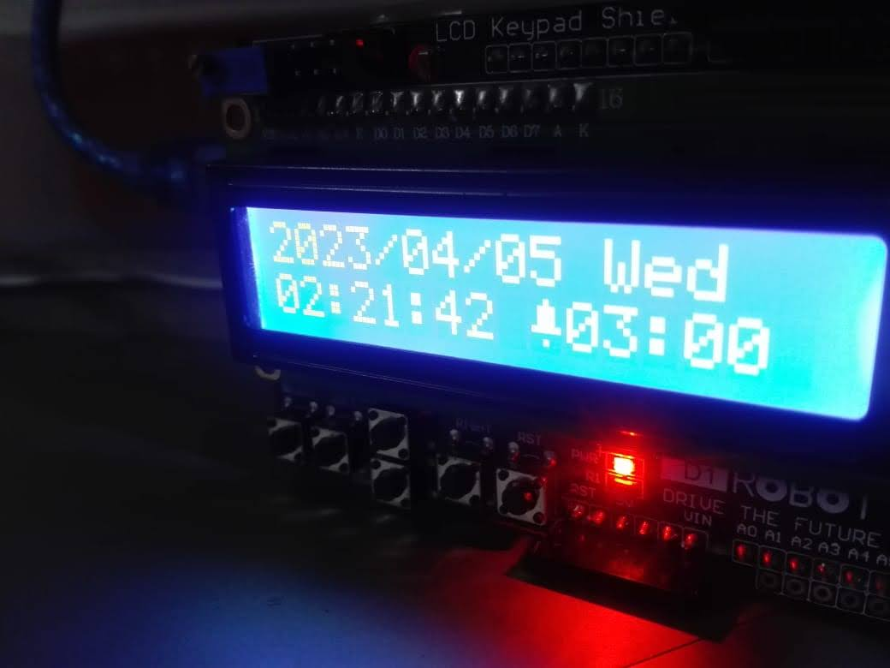
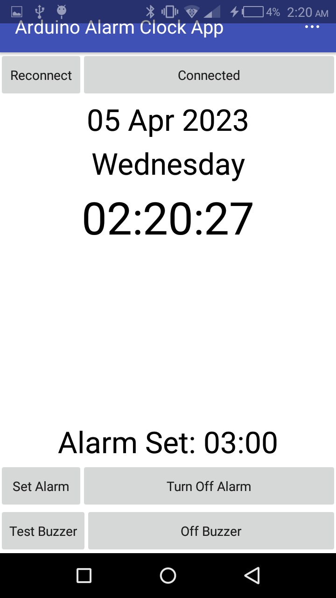
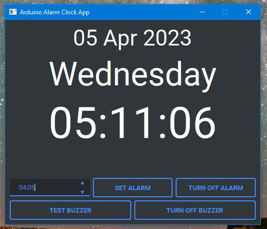

  <h1>Arduino Alarm Clock</h1>
  
<h3 align="center">Alarm Clock with Bluetooth Android App  🚀</h3>

## Specs
- LCD Keypad Shield to display date and time and Alarm controls
- Android App connected through bluetooth
- Python GUI App connected through UART/USB
- Real Time Clock Module
- Set and Save Alarm Time in EEPROM

### LCD Keypad

### Android App

### Python App

## Included in Repo
- Arduino Firmware
- Python GUI App
- Android App

## Components Used
- Arduino Uno
- Buzzer
- DS3231 Real Time Clock Module
- LCD Keypad Shield
- HC-06 Bluetooth Module

# 📝 Documentation

# 📚 References

# 🤝🏻 Connect with Me

# 📜 License

Licensed under the GPL3 License, Copyright 2025 Huzaifa Irfan. [LICENSE](LICENSE)
